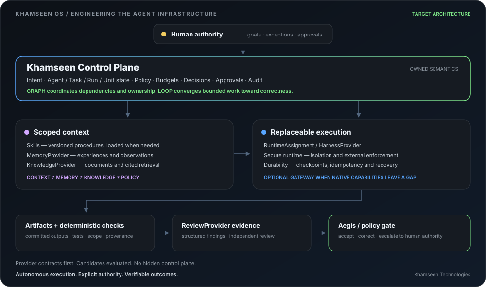

<h1 align="center">Yassine Benosmane</h1>

  <strong>Full-Stack & Geospatial Engineer · Agentic Systems Builder</strong> 
  Founder @ Khamseen Technologies

  I build production systems at the intersection of <strong>software engineering</strong>,
  <strong>geospatial platforms</strong> and <strong>AI orchestration</strong>.

  
  
  

---

  

## Engineering

- **Agent infrastructure** — control planes, capability delegation, Skills, runtime contracts, policy enforcement and audit.
- **Geospatial platforms** — ArcGIS Experience Builder, ArcGIS Maps SDK for JavaScript, spatial workflows and API-driven GIS applications.
- **Full-stack systems** — TypeScript/React, Python/Django, PostgreSQL, Redis and containerized infrastructure.
- **Reliability** — deterministic checks, independent QA, idempotency, execution leases, recovery and observable costs.

## Building Khamseen OS

> **An agent-native enterprise control plane:** one human authority coordinating specialized agents, deterministic engines and replaceable execution providers.

Khamseen owns **intent, authority, Task/Run/Unit state, policy, approvals and audit**. Execution infrastructure plugs into those contracts. The direction is a modular Core supporting Commerce, Career, Finance, GIS, SaaS and R&D through scoped business modules.

### The engineering underneath

**Graphs coordinate. Loops converge.** Dependencies reflect actual data and state consumption; independent Units can run in parallel. Each Unit uses a bounded `produce → check → correct` loop. Atomic checkout prevents conflicting claims, while execution leases and heartbeats support explicit orphan recovery.

**Capability ≠ Skill ≠ Tool.** Authorization, procedural knowledge and external actions stay separate. The Skills direction uses versioned `SKILL.md` contracts and progressive loading: metadata first, procedures when needed.

**The plumbing stays replaceable.** RuntimeAssignment and HarnessProvider separate agent identity from execution. Hermes, OpenClaw, Cursor, Codex and Claude Code belong behind this boundary; OpenClaw remains an evaluation track. SecureRuntimeProvider / SandboxProvider define isolation, while durable execution handles checkpoints and resume without owning domain state. OpenShell, Daytona, Inngest, Temporal and agentgateway are candidates whose adoption must justify a distinct role.

**Context ≠ Memory ≠ Knowledge ≠ Policy.** Scoped context serves the current Unit. MemoryProvider handles experiences and observations; KnowledgeProvider handles documents and cited retrieval. Hindsight, WeKnora and PageIndex are evaluated behind those boundaries. Context Mode is an optional context-optimization candidate. Learning becomes policy only through aggregated evidence, validation and an explicit gate.

**Review produces evidence. Aegis evaluates it.** Deterministic checks precede model judgment. ReviewProvider can supply specialized findings, with OpenCodeReview under evaluation; independent review remains a separate responsibility. Implementation, correction and review produce distinct execution evidence.

### Adoption with boundaries

I study **Paperclip** for control-plane patterns, **ECC** for selected Skills and security evidence, **Archify** for architecture artifacts, **Impeccable** for UI quality and **Univer** for Office outputs. These are evaluation or reference tracks, not a list of shipped integrations.

The current priority is **V0 closure → Skills foundation → Graph / Unit Runtime**, with secure execution, economics, memory/knowledge, learning and harness portability developed around their actual dependencies.

Human involvement moves toward **goals, exceptions and consequential approvals**. Authority and evidence remain explicit throughout.

## Stack

  
  
  
  
  
  
  
  

---

  Autonomous execution. Explicit authority. Verifiable outcomes.

